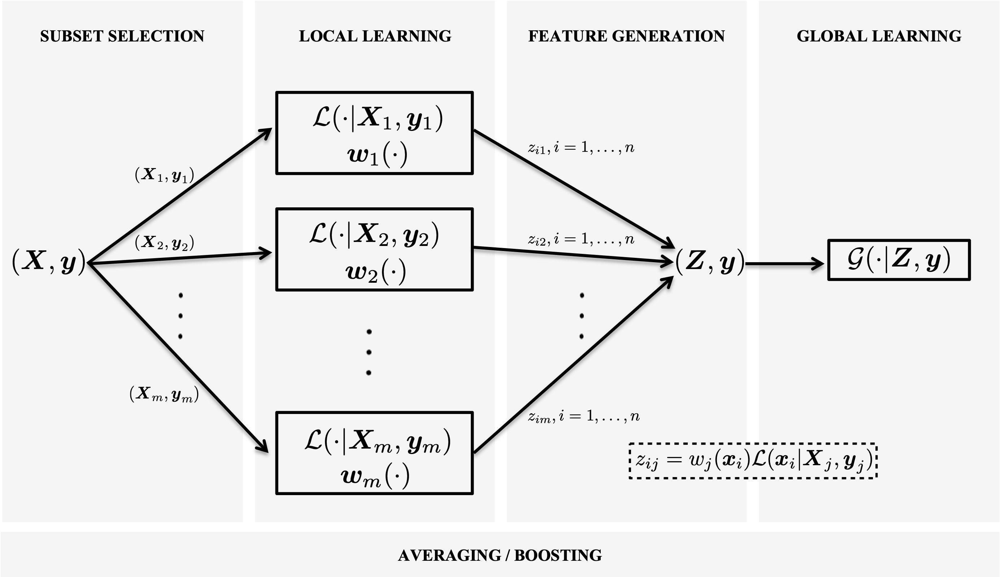

# Learning with Subset Stacking (LESS)

LESS is a supervised learning algorithm that is based on training many local estimators on subsets of a given dataset, and then passing their predictions to a global estimator. You can find the details about LESS in our [manuscript](https://arxiv.org/abs/2112.06251).



## Installation
Install `LESS` from PyPI:
```bash
pip install less-learn
```

## Getting Started

Below is a simplified example of how to use `LESS`


```python
from sklearn.datasets import make_regression
from sklearn.model_selection import train_test_split
from sklearn.metrics import mean_squared_error
from less import LESSBRegressor

# Generate a synthetic regression dataset
X, y = make_regression(n_samples=1000, n_features=20, random_state=42)

# Split into training and testing sets
X_train, X_test, y_train, y_test = train_test_split(
    X, y, test_size=0.3, random_state=42
)

# Initialize and train the LESS model
less_model = LESSBRegressor(random_state=42)
less_model.fit(X_train, y_train)

# Make predictions and evaluate performance
y_pred = less_model.predict(X_test)
mse = mean_squared_error(y_test, y_pred)
print(f"Test MSE of LESS: {mse:.2f}")
```


> **Note:**
> LESS employs Euclidean distances combined with a radial basis function (RBF) kernel by default.
> It is therefore *highly recommended* to scale or normalize input features prior to model training to ensure optimal performance.


## Citation
Our software can be cited as:
````
  @misc{LESS,
    author = "Ilker Birbil and Samet Copur",
    title = "LESS: Learning with Subset Stacking",
    year = 2025,
    url = "https://github.com/sibirbil/LESS/"
  }
````
