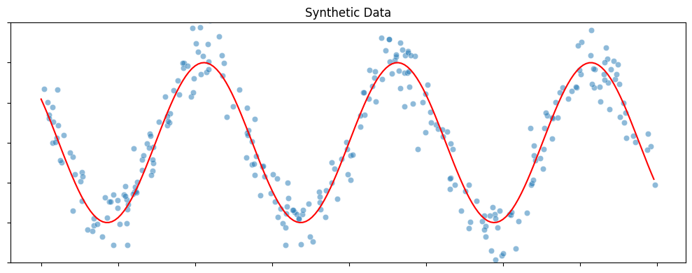
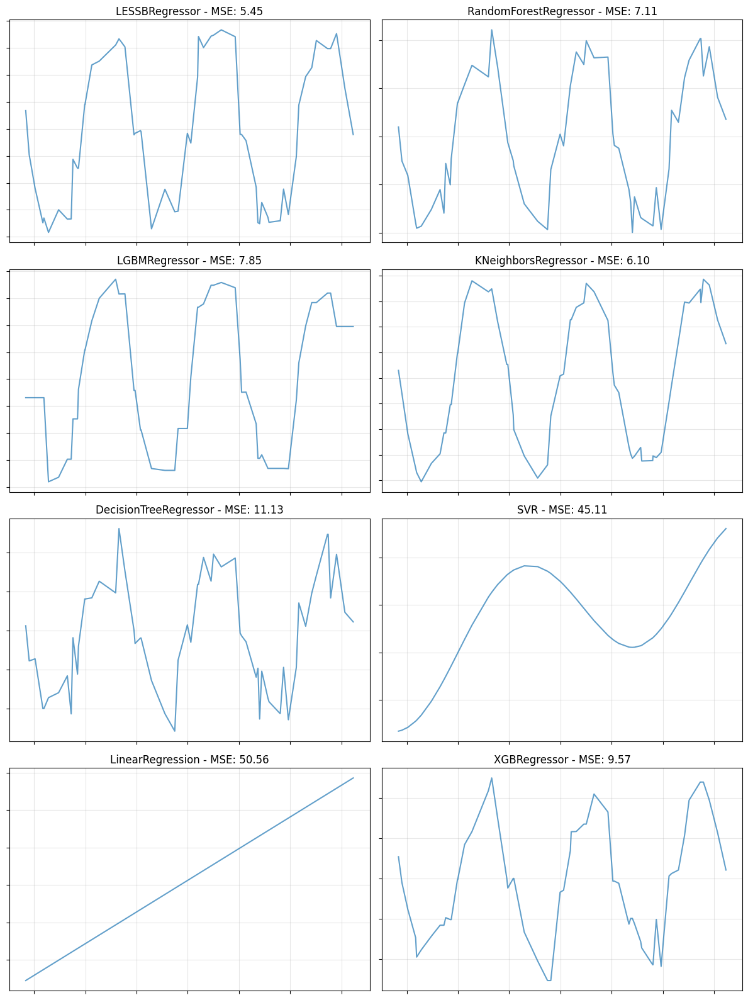
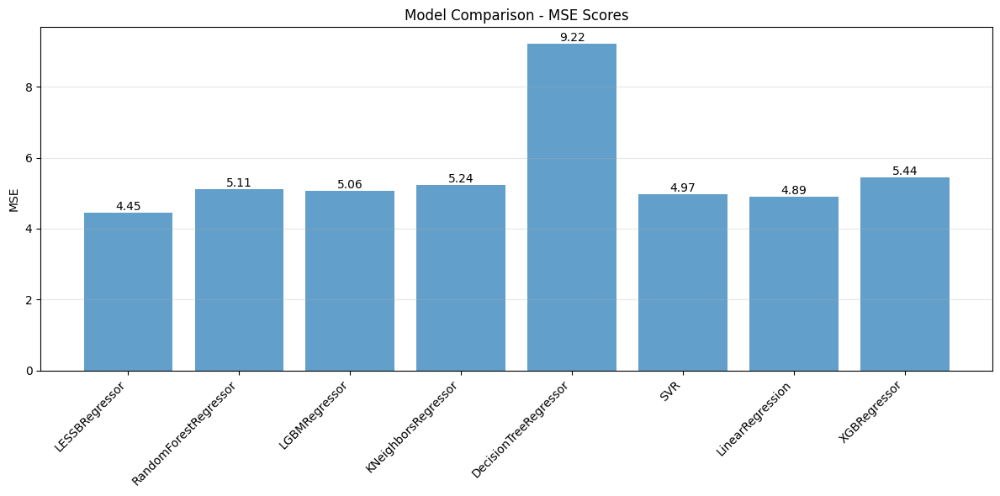

Learning with Subset Stacking (LESS)
======================================

LESS is a new supervised learning algorithm that is based on training many local estimators on subsets of a given dataset, and then passing their predictions to a global estimator. This is, of course, a rough description of LESS. In the second part of this tutorial, we will give more details about the inner workings of LESS and discuss how to change its many parameters to obtain different models. But for now, let us carry on with the default LESS and show that it works just fine out-of-the-box.

Imports
-------

First, we need to import the necessary libraries. Apart from standard data manipulation and plotting libraries like ``numpy``, ``pandas``, ``matplotlib``, and ``seaborn``, we import various regression models from ``scikit-learn``, ``xgboost``, and ``lightgbm`` for comparison. Most importantly, we import ``LESSBRegressor`` from the ``less`` package.

.. code-block:: python

    import numpy as np
    import matplotlib.pyplot as plt
    import seaborn as sns
    import pandas as pd

    from sklearn.ensemble import RandomForestRegressor
    from sklearn.neighbors import KNeighborsRegressor
    from sklearn.tree import DecisionTreeRegressor
    from sklearn.svm import SVR
    from sklearn.linear_model import LinearRegression
    from xgboost import XGBRegressor
    from lightgbm import LGBMRegressor
    from less import LESSBRegressor

    from sklearn.model_selection import train_test_split
    from sklearn.metrics import mean_squared_error
    from sklearn.preprocessing import StandardScaler
    from sklearn.datasets import fetch_openml

    import warnings

    warnings.filterwarnings("ignore")
    np.random.seed(42)

Synthetic Dataset
-----------------

Here is a simple one-dimensional regression problem. This synthetic dataset is generated by randomly sampling a set of points from the real line (input) and then adding perturbations to their function values obtained with a sine curve (output). The blue dots in the figure below shows the dataset with 300 samples.

.. code-block:: python

    def synthetic_sine_curve(n_samples=300):
        plt.figure(figsize=(10, 4))

        # Generate data
        X = np.random.uniform(-10, 10, (n_samples, 1))
        y = 10 * np.sin(X[:, 0]) + 2.5 * np.random.randn(n_samples)

        # Plot
        xvals = np.arange(-10, 10, 0.1)
        sns.lineplot(x=xvals, y=10 * np.sin(xvals), color="red")
        sns.scatterplot(x=X[:, 0], y=y, alpha=0.5)
        plt.ylim([-15, 15])
        plt.title("Synthetic Data")
        plt.tick_params(labelbottom=False, labelleft=False)
        plt.tight_layout()
        plt.show()

        return X, y

    X, y = synthetic_sine_curve()

Training LESS
-------------

You will notice that LESS uses exactly the same syntax (``fit`` & ``predict``) that is used by all the learning algorithms in ``scikit-learn``. Currently, LESS only supports regression. We are working on adding the LESS classifier.

**Data Preprocessing:**

Before training, we split the data into training and testing sets. We also scale the features using ``StandardScaler``. Scaling is often a good practice in machine learning, especially for algorithms that rely on distance metrics (like k-NN, which might be used as a local estimator in LESS) or gradient-based optimization. It ensures that all features contribute equally to the result.

.. code-block:: python

    X_train, X_test, y_train, y_test = train_test_split(
        X, y, test_size=0.2, random_state=42
    )

    scaler = StandardScaler()

    X_train = scaler.fit_transform(X_train)
    X_test = scaler.transform(X_test)

**Fitting the Model:**

We initialize ``LESSBRegressor`` with a random state for reproducibility. Then we fit the model to the training data and evaluate it on the test set.

.. code-block:: python

    LESS_model = LESSBRegressor(random_state=42)
    LESS_model.fit(X_train, y_train)
    y_pred = LESS_model.predict(X_test)

    print(f"Test error of LESS: {mean_squared_error(y_pred, y_test):0.2f}")

.. rst-class:: sphx-glr-script-out

 .. code-block:: none

    Test error of LESS: 4.65

Comparison with Other Models
----------------------------

To see how LESS performs compared to other popular regression algorithms, we define a list of models including Random Forest, LightGBM, k-NN, Decision Tree, SVR, Linear Regression, and XGBoost.

.. code-block:: python

    models = [
        LESSBRegressor(random_state=42),
        RandomForestRegressor(random_state=42),
        LGBMRegressor(random_state=42, verbose=-1),
        KNeighborsRegressor(),
        DecisionTreeRegressor(random_state=42),
        SVR(),
        LinearRegression(),
        XGBRegressor(random_state=42),
    ]

We then iterate through these models, train them on the same data, and plot their predictions (or compare their MSE scores). This visual comparison helps in understanding how different models capture the underlying pattern of the data.

.. code-block:: python

    def compare_models(X_train, X_test, y_train, y_test, models, plot="line"):
        """
        Compare multiple models by plotting their predictions or scores.
        plot="line": Creates a subplot grid showing X vs predicted values.
        plot="bar": Creates a bar chart showing MSE scores.
        """
        if plot == "bar":
            # Calculate MSE for each model
            model_names = []
            mse_scores = []

            for model in models:
                model.fit(X_train, y_train)
                y_pred = model.predict(X_test)
                mse = mean_squared_error(y_test, y_pred)
                model_names.append(model.__class__.__name__)
                mse_scores.append(mse)

            # Create bar plot
            plt.figure(figsize=(12, 6))
            bars = plt.bar(range(len(model_names)), mse_scores, alpha=0.7)
            plt.xticks(range(len(model_names)), model_names, rotation=45, ha="right")
            plt.ylabel("MSE")
            plt.title("Model Comparison - MSE Scores")
            plt.grid(True, alpha=0.3, axis="y")

            # Add MSE values on bars
            for bar, mse in zip(bars, mse_scores):
                plt.text(
                    bar.get_x() + bar.get_width() / 2,
                    bar.get_height(),
                    f"{mse:.2f}",
                    ha="center",
                    va="bottom",
                    fontsize=10,
                )

            plt.tight_layout()
            plt.show()

        else:  # plot == "line"
            # Calculate grid size
            n_models = len(models)
            n_cols = 2
            n_rows = (n_models + n_cols - 1) // n_cols

            # Create subplot grid
            fig, axes = plt.subplots(n_rows, n_cols, figsize=(12, 4 * n_rows))
            axes = axes.flatten()

            # Plot each model
            for idx, model in enumerate(models):
                # Train and predict
                model.fit(X_train, y_train)
                y_pred = model.predict(X_test)
                mse = mean_squared_error(y_test, y_pred)

                # Sort for line plot
                sort_idx = X_test[:, 0].argsort()
                X_sorted = X_test[sort_idx, 0]
                y_pred_sorted = y_pred[sort_idx]

                # Plot
                ax = axes[idx]
                ax.plot(X_sorted, y_pred_sorted, alpha=0.7)
                ax.set_title(f"{model.__class__.__name__} - MSE: {mse:.2f}")
                ax.tick_params(labelbottom=False, labelleft=False)
                ax.grid(True, alpha=0.3)

            # Hide extra subplots
            for i in range(len(models), len(axes)):
                axes[i].axis("off")

            plt.tight_layout()
            plt.show()

.. code-block:: python

    # Run comparison
    compare_models(X_train, X_test, y_train, y_test, models, plot="line")

Experiment with Abalone Dataset
-------------------------------

Let's try with a larger dataset. We will use the Abalone dataset which has 4177 rows and 8 columns.

.. code-block:: python

    abalone = fetch_openml(name="abalone", version=1, as_frame=True)

    X = pd.get_dummies(abalone.data, drop_first=True, dtype=np.float32)
    y = abalone.target.astype(np.float32)

    X_train, X_test, y_train, y_test = train_test_split(
        X, y, test_size=0.2, random_state=42
    )

    scaler = StandardScaler()

    X_train = scaler.fit_transform(X_train)
    X_test = scaler.transform(X_test)

We can also compare the models based on their Mean Squared Error (MSE) using a bar chart.

.. code-block:: python

    # Run comparison with bar plot
    compare_models(X_train, X_test, y_train, y_test, models, plot="bar")

